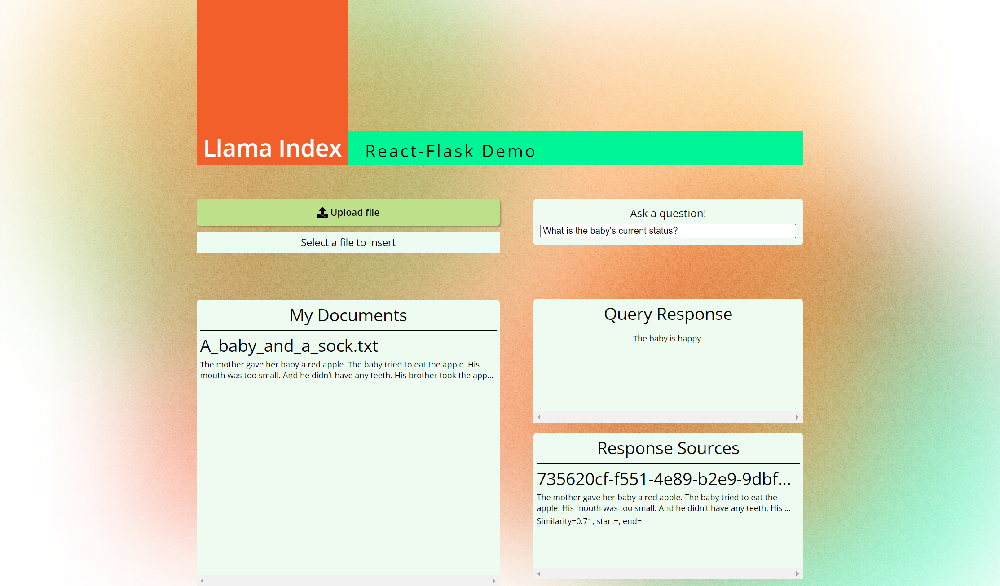

# Flask React

## 1. Run dockerfile

1. Switch to the directory `./llama_index_starter_pack/flask_react` where the `Dockerfile` locates.

   ``` bash
   cd ./llama_index_starter_pack/flask_react
   ```

   Run the command below to create docker image here named as `flask_react`.

   ``` bash
   docker build -t flash_react .
   ```

   > <font color="grey">Note</font>
   >
   > Here `flash_react` is the image name which we generate.

2. Set `pip` and `npm` mirrors as needed.

   ```` bash  
   pip config set global.index-url https://mirrors.tuna.tsinghua.edu.cn/pypi/web/simple
   ````

   ``` bash
   npm config set registry https://registry.npmmirror.com/ 
   ```

3. Start a container to run the image.

   ``` bash
   docker run -p 5601:5601 -p 3000:3000 flash_react
   ```

   Then we'll see two servers started, one is the back-end (port 5601), and the other is the front-end(port 3000).

   If we want to stop them, we can run `CTRL+C` 3 times, and the terminal command will come back to the directory `./llama_index_starter_pack/flask_react`.

   If we want to give a name to the container and run it in background, we can run the command as follows:

   ``` bash
   docker run -p 5601:5601 -p 3000:3000 --name flash_react_ctn -d flash_react
   ```

## 2. Manually Start Servers

We can also manually start the back-end servers, and  test the interfaces via `Postman` or `Apifox`.

First we activate the environment that has been created and been used before.

``` bash
conda activate llama_index
```

Second, we switch to the location where `index_server.py`and   `flask_demo.py` located.

``` bash
cd ./llama_index_starter_pack/flask_react
```

And then we start `index_server.py`and   `flask_demo.py` separately (using two terminals).

``` 
python index_sersver.py
```

``` bash
python flask_demo.py
```

After these operations, we can test the interfaces via `Postman` or `Apifox`.


   
